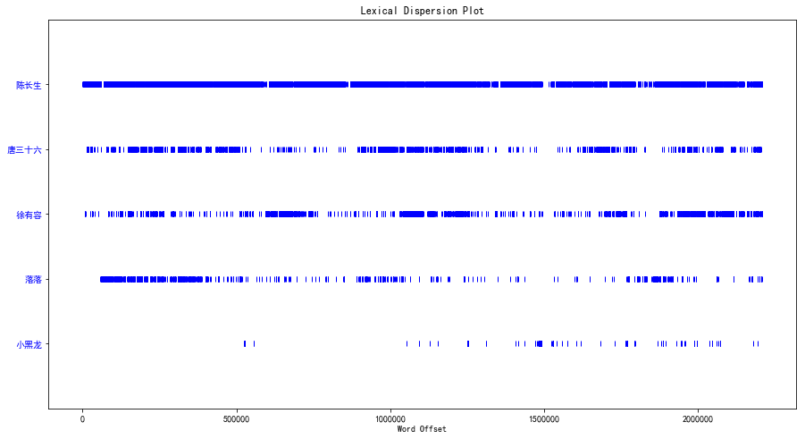
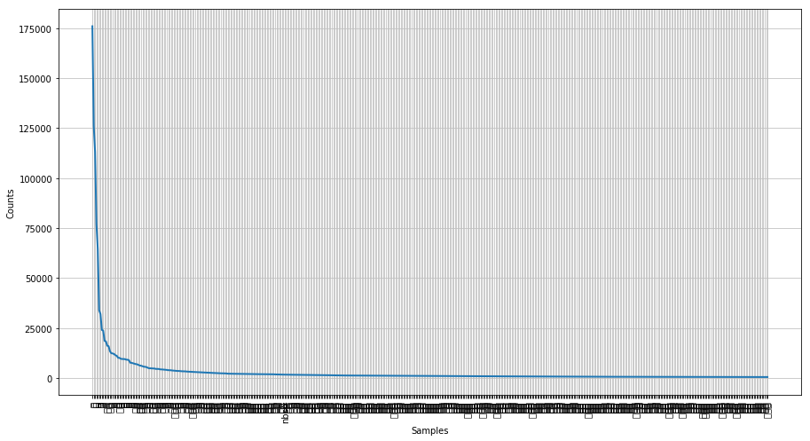
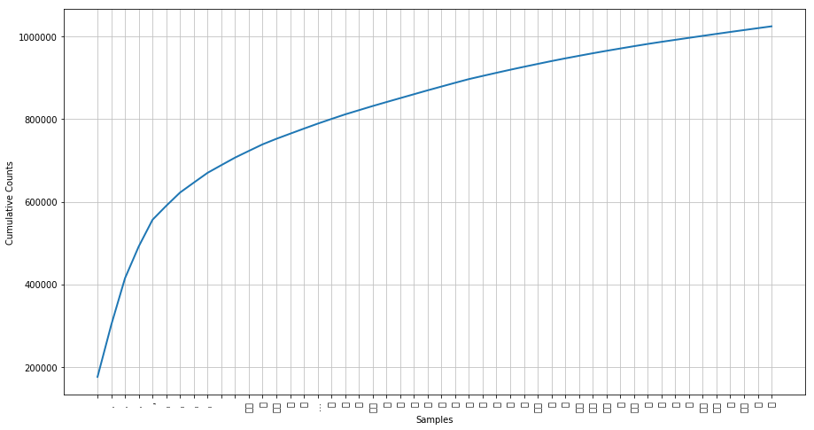

# NLTK中文扩展


## NLTK自带繁体中文语料


```python
#!/usr/bin/env python
# -*- coding: utf-8 -*-

import nltk
from nltk.corpus import sinica_treebank
 
sinica_text = nltk.Text(sinica_treebank.words())
print(sinica_text)
for (key, var) in sinica_treebank.tagged_words()[:8]:
    print('%s/%s' % (key, var))
```

    <Text: 一 友情 嘉珍 和 我 住在 同一條 巷子...>
    一/Neu
    友情/Nad
    嘉珍/Nba
    和/Caa
    我/Nhaa
    住在/VC1
    同一條/DM
    巷子/Nab
    


```python
sents = sinica_treebank.parsed_sents()
sents[3452].draw()
```


```python
% matplotlib inline
sents[3452].draw()
```


```python
print(sinica_text.concordance(u'嘉珍'))
```

    Displaying 6 of 6 matches:
                                          嘉珍 和 我 住在 同一條 巷子 我們 是 鄰居 也 是 同班 同學 我們 常常
     任何 動靜 正當 我 想 離開 時 門 內 突然 傳來 急促 的 腳步聲 嘉珍 打開 了 門 大聲 的 叫 著 快 點 我 媽媽 暈倒 了 嘉珍 抓起 我
     腳步聲 嘉珍 打開 了 門 大聲 的 叫 著 快 點 我 媽媽 暈倒 了 嘉珍 抓起 我 的 手 急忙 往 屋 裡 跑 進入 房間 看到 她 的 媽媽 趴
    地 上 臉色 蒼白 得 像 紙 一樣 這種 情景 把 我 嚇壞 了 怎麼辦 嘉珍 不停 的 哭泣 聲音 有些 顫抖 我 的 腦海 中 頓時 一片 空白 不 
    怎麼辦 才 好 過 了 一會兒 我 才 問 她 你 爸爸 呢 他 出差 了 嘉珍 擦 著 眼淚 我 握住 她 的 雙手 她 的 手 又 冰 又 冷 這時 有
     在 她 家 門口 醫護 人員 很 快 的 將 她 的 媽媽 抬上 救護車 嘉珍 上車 前 對 我 說 謝謝 你 的 幫忙 我 握 著 她 的 手 說 不用
    None
    

## 自建中文Text


```python
import jieba
jieba.add_word(u"陈长生",tag="nz")
jieba.add_word(u"徐有容",tag="nz")
jieba.add_word(u"唐三十六",tag="nz")
jieba.add_word(u"落落",tag="nz")
jieba.add_word(u"小黑龙",tag="nz")

with open("docs/assets/择天记.txt",encoding="utf-8") as fp:
    book = fp.read()
words = jieba.lcut(book)
text = nltk.Text(words)
```


```python
text.concordance(u"小黑龙")
```

    Displaying 25 of 200 matches:
     的 大 神通 ！ 
     
     玉如意 顿时 活 了 过来 ， 变成 了 一只 小黑龙 。 
     
     那 只 小黑龙 在 圣后 的 手掌 里静静 躺 着 ， 看似 
    玉如意 顿时 活 了 过来 ， 变成 了 一只 小黑龙 。 
     
     那 只 小黑龙 在 圣后 的 手掌 里静静 躺 着 ， 看似 很 虚弱 ， 但 它 的 眼
     你 似乎 应该 先 怨恨 自己 。 ” 
     
     圣后 看着 掌 心里 的 小黑龙 ， 平静 说道 ： “ 离魂 不能 归 ， 最终 是 怎样 酷烈 的 下场
     回来 的 冰凉 感觉 ， 才 最终 证明 这 一切都是 真的 。 
     
     小黑龙 明显 很 不 喜欢 他 的 触 碰 ， 啪 的 一声 ， 把 他 的 手掌
    这 … … 到底 是 怎么回事 ？ ” 陈长生 紧张 地 问道 。 
     
     小黑龙 没有 说话 ， 飞 到 桌旁 ， 在 砚台 里 蘸 了 些 残墨 ， 用 
    种 秘法 ， 今天 就要 跟 我 出 京都 逛逛 ？ ” 
     
     他 看着 小黑龙 ， 无比 震惊 说道 ： “ 还要 我 负责 保护 你 的 安全 ？ ” 
    比 震惊 说道 ： “ 还要 我 负责 保护 你 的 安全 ？ ” 
     
     小黑龙 飘 在 他 的 眼前 ， 点 了 点头 。 
     
     陈长生 捂额 无语 ，
    ， 不 知道 会 遇到 什么 麻烦 ， 万一出 事 怎么办 ？ ” 
     
     小黑龙 不 说话 ， 只是 静静地 看着 他 。 
     
     陈长生 的 眼光 与 它
    着 他 。 
     
     陈长生 的 眼光 与 它 的 目光 相接 ， 注意 到 小黑龙 眸中 的 神情 看似 漠然 ， 深处 却 隐着 一抹 炙热 。 
     
     他
    间 ， 说道 ： “ 好 的 ， 吱吱 。 ” 
     
     听到 他 的话 ， 小黑龙 的 眼神 依旧 冷漠 高贵 ， 却 吱吱叫 了 两声 。 
     
     陈长生 
    潭 畔 ， 他 轻抚 剑柄 ， 看着 不知 何时 又 趴在 自己 肩上 的 小黑龙 ， 说道 ： “ 要不然 … … ” 
     
     黑龙 看着 他 ， 眼眸 里
    陈长生 抬起 右臂 ， 让 它 停 在 了 小臂 上 。 
     
     溪水 从 小黑龙 的 鳞片 上 淌 落 ， 打湿 了 了 他 的 袖子 ， 有些 凉 ， 感
    容 看 了 她 一眼 ， 问道 ： “ 当时 你 在 信 里面 说 他 与 小黑龙 的 事情 … … 是 真的 还是 假 的 ？ ” 
     
     “ 千真万确 ，
    舒服 ， 比如 那 件 事情 。 
     
     “ 你 和 落落 殿下 ， 还有 小黑龙 之间 ？ ” 
     
     徐有容 没有 言明 ， 陈长生 却 明白 她 是 在
    大 的 冲击 ， 以至于 没有 注意 到 徐有容 除了 落落 还 提到 过 小黑龙 。 
     
     他 有些 无奈 分辩 道 ： “ 想 ， 我们 两个 人 现在
    ” 
     
     陈长生 怔 了 怔 才 明白 ， 她 说 的 朱砂 姑娘 就是 小黑龙 ， 不解 问道 ： “ 亲近 ？ ” 
     
     “ 莫雨见 过 你们 曾经 
    石 大会 。 ” 
     
     现在 这个 世界 上 ， 大概 也 只有 他 和 小黑龙 才 会 用 白痴 两个 字 形容 陈长生 。 
     
     “ 你 才 是 白痴
     
     
     陈长生 想 起来 徐有容 曾经 对 自己 说 过 ， 好像 当年 小黑龙 就 有 名字 ， 似乎 是 叫 朱砂 ， 然而 还 没有 开口 … … 
    
    来 这里 很 多次 ， 研究 石墙 上 的 阵法 ， 思考 如何 破阵 助 小黑龙 离开 ， 一直 都 没有 让 她 旁观 过 。 
     
     不是 他 的 破阵
    今天 他 要 前去 观看 ， 因为 以后 可能 没有 机会 了 。 
     
     小黑龙 想 了 想 ， 站 起身 来 ， 转身 后 远方 的 那座 石壁 走 去 
     遇到 了 什么 障碍 还是 体内 伤情 发作 带来 的 痛楚 。 
     
     小黑龙 习惯性 地 坐在 满地 冰雪 里 ， 抬着 小脸 看着 石壁 上 的 画像
    “ 你 有没有 什么 方法 可以 让 自己 暂时 昏迷不醒 ？ ” 
     
     小黑龙 睁 圆 眼睛 看着 他 ， 心想 这是 什么 要求 。 
     
     陈长生 本
    “ 无论 稍后 发生 什么 事情 ， 你 最好 能够 忍住 。 ” 
     
     小黑龙 忽然 觉得 有些 不 对 ， 伸手 准备 把 他 击倒 ， 然而 却 晚 
    ， 应该 不会 飘出 北新桥 去 。 
     
     但 有 个 问题 。 
     
     小黑龙 就 在 他 的 身边 ， 就 在 阵法 笼罩 的 范围 之内 ， 一直 在
    
     
     那种 气息 仿佛 有着 光阴 的 片段 神力 。 
     
     这时 ， 小黑龙 来到 了 地面 ， 黑发 狂舞 ， 秀丽 的 容颜 上满 是 煞意 ， 同
    


```python
text.count("陈长生")
```


    15952


```python
import pylab
### 调整图的大小
pylab.rcParams['figure.figsize'] = (15.0, 8.0)

import matplotlib
#指定默认字体，在~/.matplotlib/fontList.json中发现simhei
matplotlib.rcParams['font.family']='simhei'  
#解决负号'-'显示为方块的问题  
matplotlib.rcParams['axes.unicode_minus']=False  

text.dispersion_plot([u"陈长生", u"唐三十六", u"徐有容", u"落落", u"小黑龙"])
```





```python
fdist = nltk.FreqDist(text)
fdist.plot(500)
```





```python
fdist.plot(50,cumulative=True)
```





```python
fdist.N()
```


    2227853


```python
fdist.B()
```


    55522


