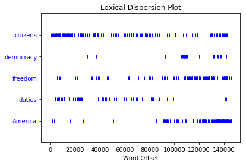
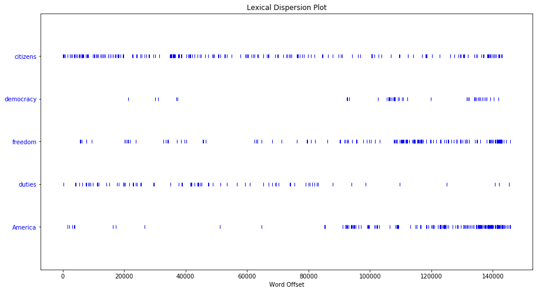

# 第一章 语言处理与Python

先搞个小计算


```
1+5*2-3
```


    8


有什么书呢？


```
from nltk.book import *
```

    *** Introductory Examples for the NLTK Book ***
    Loading text1, ..., text9 and sent1, ..., sent9
    Type the name of the text or sentence to view it.
    Type: 'texts()' or 'sents()' to list the materials.
    text1: Moby Dick by Herman Melville 1851
    text2: Sense and Sensibility by Jane Austen 1811
    text3: The Book of Genesis
    text4: Inaugural Address Corpus
    text5: Chat Corpus
    text6: Monty Python and the Holy Grail
    text7: Wall Street Journal
    text8: Personals Corpus
    text9: The Man Who Was Thursday by G . K . Chesterton 1908
    

看一看


```
text1
```


    <Text: Moby Dick by Herman Melville 1851>


```
text2
```


    <Text: Sense and Sensibility by Jane Austen 1811>


```
text1.concordance("monstrous")
```

    Displaying 11 of 11 matches:
    ong the former , one was of a most monstrous size . ... This came towards us , 
    ON OF THE PSALMS . " Touching that monstrous bulk of the whale or ork we have r
    ll over with a heathenish array of monstrous clubs and spears . Some were thick
    d as you gazed , and wondered what monstrous cannibal and savage could ever hav
    that has survived the flood ; most monstrous and most mountainous ! That Himmal
    they might scout at Moby Dick as a monstrous fable , or still worse and more de
    th of Radney .'" CHAPTER 55 Of the Monstrous Pictures of Whales . I shall ere l
    ing Scenes . In connexion with the monstrous pictures of whales , I am strongly
    ere to enter upon those still more monstrous stories of them which are to be fo
    ght have been rummaged out of this monstrous cabinet there is no telling . But 
    of Whale - Bones ; for Whales of a monstrous size are oftentimes cast up dead u
    


```
text1.similar("monstrous")
```

    true contemptible christian abundant few part mean careful puzzled
    mystifying passing curious loving wise doleful gamesome singular
    delightfully perilous fearless
    


```
text2.similar("monstrous")
```

    very so exceedingly heartily a as good great extremely remarkably
    sweet vast amazingly
    


```
text2.common_contexts(["monstrous", "very"])
```

    a_pretty am_glad a_lucky is_pretty be_glad
    


```
text4.dispersion_plot(["citizens", "democracy", "freedom", "duties", "America"])
```





图太小不好看，调一调


```
import pylab
pylab.rcParams['figure.figsize'] = (15.0, 8.0)
text4.dispersion_plot(["citizens", "democracy", "freedom", "duties", "America"])
```





```
len(text3)
```


    44764


